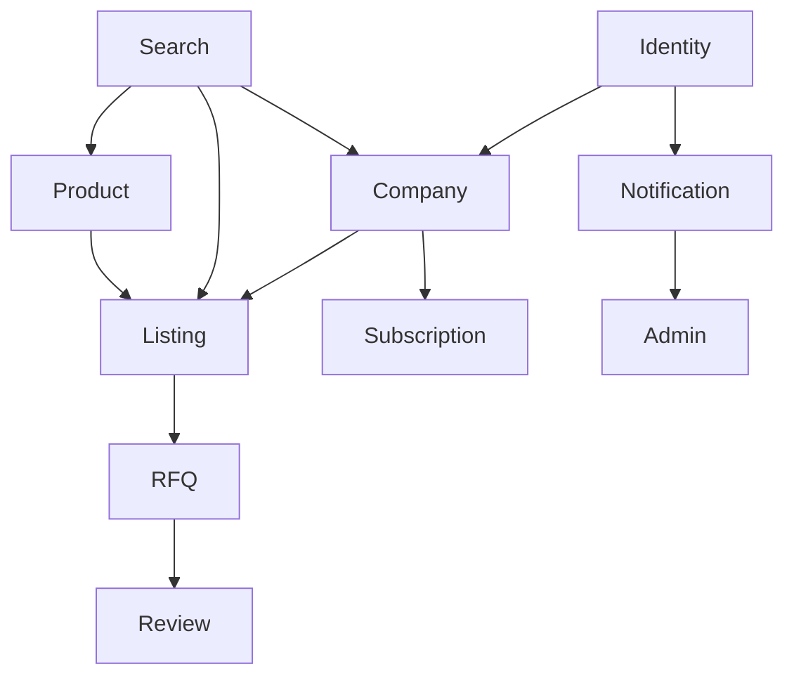

# Synthora Entity Relationship Diagram

Version: 1.0

Status: Active

Last Updated: August 2026

---

# Purpose

This document defines the high-level Entity Relationship Diagram (ERD) for Synthora.

It establishes the ownership, relationships and cardinality between all major business entities.

This document serves as the source of truth for:

- PostgreSQL Database Schema
- Flyway Migrations
- Spring Boot JPA Entities
- Repository Layer
- Service Layer

This document intentionally focuses on relationships rather than individual table columns.

---

# 1. Domain Dependency Diagram

---

# 2. High-Level Entity Relationship Diagram

```mermaid
erDiagram

%% =====================
%% Identity
%% =====================

USER ||--o{ COMPANY_MEMBER : belongs_to

USER ||--o{ USER_SESSION : owns

USER ||--o{ REFRESH_TOKEN : owns

USER ||--o{ EMAIL_VERIFICATION : verifies

USER ||--o{ PASSWORD_RESET : requests

USER ||--o{ SEARCH_HISTORY : performs

USER ||--o{ SAVED_ITEM : saves

USER ||--o{ NOTIFICATION : receives

USER ||--o{ REVIEW : writes

USER ||--o{ RFQ : creates


%% =====================
%% Company
%% =====================

COMPANY ||--o{ COMPANY_MEMBER : contains

COMPANY ||--o{ COMPANY_ADDRESS : has

COMPANY ||--o{ COMPANY_DOCUMENT : uploads

COMPANY ||--o{ VERIFICATION_CASE : submits

COMPANY ||--o{ SUPPLIER_LISTING : owns

COMPANY ||--o{ RFQ : owns

COMPANY ||--o{ QUOTATION : submits

COMPANY ||--|| COMPANY_SUBSCRIPTION : owns


%% =====================
%% Product
%% =====================

CATEGORY ||--o{ MASTER_PRODUCT : contains

MASTER_PRODUCT ||--o{ PRODUCT_SYNONYM : has

MASTER_PRODUCT ||--o{ PRODUCT_APPLICATION : has

MASTER_PRODUCT ||--o{ PRODUCT_REVISION : tracks

MASTER_PRODUCT ||--o{ PRODUCT_REQUEST : requested_for

MASTER_PRODUCT ||--o{ SUPPLIER_LISTING : listed_as


%% =====================
%% Listing
%% =====================

SUPPLIER_LISTING ||--o{ LISTING_VARIANT : has

SUPPLIER_LISTING ||--o{ LISTING_IMAGE : contains

SUPPLIER_LISTING ||--o{ LISTING_DOCUMENT : contains

SUPPLIER_LISTING ||--o{ REVIEW : receives

SUPPLIER_LISTING ||--o{ RFQ : requested_for

LISTING_VARIANT ||--o{ VARIANT_ATTRIBUTE_VALUE : stores

ATTRIBUTE_DEFINITION ||--o{ VARIANT_ATTRIBUTE_VALUE : defines


%% =====================
%% RFQ
%% =====================

RFQ ||--o{ RFQ_MESSAGE : contains

RFQ ||--o{ RFQ_ATTACHMENT : contains

RFQ ||--o{ RFQ_STATUS_HISTORY : tracks

RFQ ||--o{ QUOTATION : receives


%% =====================
%% Review
%% =====================

REVIEW ||--o{ REVIEW_REPORT : reported_as


%% =====================
%% Notification
%% =====================

NOTIFICATION ||--o{ EMAIL_QUEUE : queues


%% =====================
%% Subscription
%% =====================

SUBSCRIPTION_PLAN ||--o{ COMPANY_SUBSCRIPTION : assigned

COMPANY_SUBSCRIPTION ||--o{ SPONSORED_CAMPAIGN : includes

SPONSORED_CAMPAIGN }o--|| SUPPLIER_LISTING : promotes


%% =====================
%% Admin
%% =====================

ADMIN_USER ||--o{ AUDIT_LOG : creates

ADMIN_USER ||--o{ MODERATION_QUEUE : manages

ADMIN_USER ||--o{ SYSTEM_CONFIGURATION : manages
```

---

# 3. Domain Ownership

| Domain | Owned Entities |
|---------|----------------|
| Identity | User, UserSession, RefreshToken, EmailVerification, PasswordReset |
| Company | Company, CompanyMember, CompanyAddress, CompanyDocument, VerificationCase |
| Product | Category, MasterProduct, ProductSynonym, ProductApplication, ProductRevision, ProductRequest |
| Listing | SupplierListing, ListingVariant, AttributeDefinition, VariantAttributeValue, ListingImage, ListingDocument |
| RFQ | RFQ, Quotation, RFQMessage, RFQAttachment, RFQStatusHistory |
| Search | SearchHistory, SavedItem |
| Notification | Notification, EmailQueue |
| Subscription | SubscriptionPlan, CompanySubscription, SponsoredCampaign |
| Review | Review, ReviewReport |
| Admin | AuditLog, ModerationQueue, SystemConfiguration |

---

# 4. Cross-Domain Relationships

Identity

↓

Company

↓

Supplier Listing

↓

Master Product

↓

RFQ

↓

Quotation

↓

Review

↓

Notification

↓

Administration

---

# 5. Ownership Principles

Master Products are owned by Synthora.

Supplier Listings are owned by Companies.

Scientific information belongs to Synthora.

Commercial information belongs to Companies.

RFQs belong to Buyer Companies.

Reviews belong to Supplier Listings.

Subscriptions belong to Companies.

Notifications belong to Users.

Audit Logs belong to the Administration domain.

---

# 6. Relationship Principles

One Company may own many Supplier Listings.

One Master Product may have many Supplier Listings.

One Supplier Listing may have many Variants.

One Supplier Listing may receive many RFQs.

One RFQ may contain many Messages.

One RFQ may contain many Attachments.

One RFQ may receive many Quotations.

One Supplier Listing may receive many Reviews.

One User may belong to multiple Companies in future releases.

Each Company may contain multiple Users in future releases.

All business ownership belongs to Companies rather than Users.

---

# 7. Future Expansion

The database architecture has been designed to support:

- Multi-user Companies
- Multi-branch Companies
- Multi-language Products
- International Marketplace
- ERP Integration
- AI-assisted Search
- Feature Flags
- Marketplace Analytics
- Enterprise Authentication
- Microservice Extraction

without requiring fundamental schema redesign.

---

# 8. Notes

This ERD intentionally omits table columns.

Columns, constraints, indexes and data types are defined in:

04_Table_Specifications.md

The PostgreSQL schema must follow this document exactly.

All Spring Boot entities must preserve the relationships defined here.