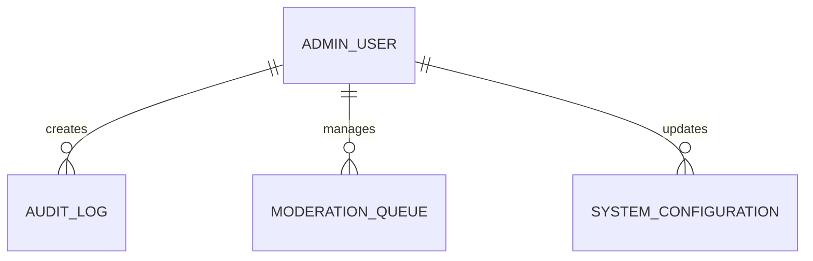

# Admin Database Specification

Version: 1.0

Status: Active

Last Updated: August 2026

---

# Purpose

The Admin domain manages platform administration, moderation, auditing and system configuration.

It provides administrative oversight across all business domains while maintaining complete auditability.

This specification defines all Admin-related database tables.

---

# Tables Included

1. AuditLog

2. ModerationQueue

3. SystemConfiguration

---

# Domain Ownership

Owner Domain

Admin

Dependencies

Identity

Company

Listing

Product

RFQ

Review

Subscription

Notification

Used By

Entire Platform

---

# Database Design Principles

Every administrative action should be auditable.

Moderation should preserve historical records.

Configuration changes should never require database redesign.

Administrative operations must never modify historical audit records.

---

# Entity Relationship

---

# 1. AuditLog

## Purpose

Stores every important administrative and security event occurring within the platform.

Audit Logs provide traceability, compliance and debugging support.

---

## Columns

| Column | Type | Required | Notes |
|---------|------|----------|------|
| id | UUID v7 | Yes | Primary Key |
| reference_number | VARCHAR(30) | Yes | Public Identifier |
| performed_by_user_id | UUID | Yes | FK |
| action_type_id | UUID | Yes | Lookup FK |
| entity_type | VARCHAR(100) | Yes | |
| entity_id | UUID | No | |
| old_value | JSONB | No | |
| new_value | JSONB | No | |
| ip_address | INET | No | |
| user_agent | TEXT | No | |
| created_at | TIMESTAMPTZ | Yes | |

---

## Constraints

Primary Key

id

Unique

reference_number

---

## Indexes

performed_by_user_id

action_type_id

entity_type

created_at

---

## Business Rules

Audit Logs are immutable.

Audit Logs are never deleted.

Sensitive information must be masked.

All administrative actions create Audit Logs.

---

# 2. ModerationQueue

## Purpose

Tracks entities requiring administrative review.

Supports moderation of Companies, Listings, Product Requests and Reviews.

---

## Columns

| Column | Type | Required |
|---------|------|----------|
| id | UUID v7 | Yes |
| entity_type | VARCHAR(100) | Yes |
| entity_id | UUID | Yes |
| moderation_type_id | UUID | Yes |
| priority_id | UUID | Yes |
| status_id | UUID | Yes |
| assigned_admin_id | UUID | No |
| remarks | TEXT | No |
| resolved_at | TIMESTAMPTZ | No |
| created_at | TIMESTAMPTZ | Yes |

---

## Constraints

Primary Key

id

---

## Indexes

entity_type

status_id

priority_id

assigned_admin_id

created_at

---

## Business Rules

Each moderation request belongs to one entity.

Only Administrators may resolve moderation items.

Moderation history is preserved.

---

# 3. SystemConfiguration

## Purpose

Stores configurable platform settings.

Allows administrators to modify operational behavior without code changes.

---

## Columns

| Column | Type | Required |
|---------|------|----------|
| id | UUID v7 | Yes |
| configuration_key | VARCHAR(255) | Yes |
| configuration_value | TEXT | Yes |
| data_type | VARCHAR(50) | Yes |
| description | TEXT | No |
| updated_by_user_id | UUID | Yes |
| updated_at | TIMESTAMPTZ | Yes |

---

## Constraints

Primary Key

id

Unique

configuration_key

---

## Indexes

configuration_key

updated_at

---

## Business Rules

Configuration Keys are unique.

Configuration changes are audited.

Only Super Administrators may modify configuration.

---

# Lookup Tables Used

ActionType

ModerationType

ModerationStatus

Priority

ConfigurationDataType

---

# Domain Events

Configuration Updated

↓

Audit Log Created

↓

Moderation Assigned

↓

Moderation Completed

↓

Administrative Notification Sent

---

# Security Rules

Only Administrators may access Admin tables.

Only Super Administrators may modify System Configuration.

Audit Logs are read-only after creation.

Every administrative action generates an Audit Log.

---

# Performance

Indexes

Action Type

Entity Type

Created Date

Moderation Status

Assigned Administrator

Configuration Key

---

# Future Expansion

Feature Flags

Background Job Management

Maintenance Mode

API Key Management

Platform Analytics

Admin Dashboard Metrics

Permission Management

Role-Based Access Control (RBAC)

System Health Monitoring

---

# Acceptance Criteria

Administrators can

View Audit Logs

Review Moderation Queue

Approve or Reject Requests

Manage System Configuration

Track Administrative History

Assign Moderation Tasks

The Admin domain provides complete governance, auditing and operational control for the KemKendra platform.

---

# Decision Authority

When a conflict exists between documents, the following precedence applies.

1. Product Requirements

2. Engineering Specifications

3. Database Standards

4. ERD

5. Table Specifications

6. PostgreSQL Schema

7. Source Code

No lower-level document may contradict a higher-level document without an approved architectural decision.

---