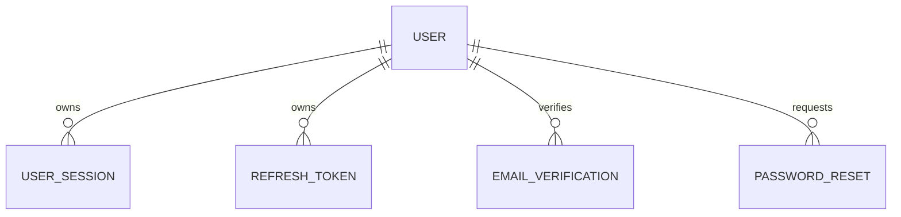

# Identity Database Specification

Version: 1.0

Status: Active

Last Updated: August 2026

---

# Purpose

The Identity domain manages user authentication, authorization, account lifecycle and secure access to Synthora.

This specification defines all database tables related to user identity.

Tables Included

1. User
2. UserSession
3. RefreshToken
4. EmailVerification
5. PasswordReset

---

# Domain Ownership

Owner Domain

Identity

Dependencies

None

Used By

Company

RFQ

Review

Notification

Admin

---

# Database Design Principles

The Identity module owns all authentication data.

Business data must never be stored here.

Authentication and business ownership remain separate.

Users own identities.

Companies own business assets.

---

# Entity Relationship

---

# Table 1

## User

### Purpose

Represents a person using Synthora.

A User is an individual identity.

A User may belong to one or more Companies in future versions.

---

### Columns

| Column | Type | Required | Notes |
|---------|------|----------|------|
| id | UUID v7 | Yes | Primary Key |
| reference_number | VARCHAR(30) | Yes | Public Identifier |
| email | VARCHAR(255) | Yes | Unique |
| password_hash | TEXT | Yes | BCrypt Hash |
| first_name | VARCHAR(100) | Yes | |
| last_name | VARCHAR(100) | Yes | |
| phone | VARCHAR(20) | No | |
| profile_image | TEXT | No | Storage URL |
| email_verified | BOOLEAN | Yes | Default FALSE |
| account_status | Lookup FK | Yes | |
| last_login_at | TIMESTAMPTZ | No | |
| created_at | TIMESTAMPTZ | Yes | |
| created_by | UUID | No | |
| updated_at | TIMESTAMPTZ | Yes | |
| updated_by | UUID | No | |
| deleted_at | TIMESTAMPTZ | No | |
| deleted_by | UUID | No | |
| version | INTEGER | Yes | Optimistic Lock |

---

### Constraints

Primary Key

id

Unique

email

reference_number

---

### Indexes

email

reference_number

account_status

deleted_at

---

### Business Rules

Email must be unique.

Passwords are never stored in plain text.

Email verification required before marketplace participation.

Users cannot own Listings.

Users cannot own Products.

Users own identity only.

---

### Future Expansion

MFA

OAuth

SSO

Profile Preferences

---

# Table 2

## UserSession

### Purpose

Tracks active login sessions.

---

### Columns

| Column | Type | Required |
|---------|------|----------|
| id | UUID v7 | Yes |
| user_id | UUID | Yes |
| device_name | VARCHAR(150) | No |
| browser | VARCHAR(150) | No |
| operating_system | VARCHAR(100) | No |
| ip_address | INET | No |
| last_activity | TIMESTAMPTZ | Yes |
| expires_at | TIMESTAMPTZ | Yes |
| revoked_at | TIMESTAMPTZ | No |
| created_at | TIMESTAMPTZ | Yes |

---

### Relationships

User

↓

Many Sessions

---

### Indexes

user_id

expires_at

---

### Business Rules

Expired sessions become invalid.

Revoked sessions cannot authenticate.

---

# Table 3

## RefreshToken

### Purpose

Stores refresh tokens used for JWT authentication.

---

### Columns

id

user_id

token_hash

expires_at

revoked_at

created_at

---

### Rules

Store only hashed tokens.

One refresh token belongs to one session.

---

# Table 4

## EmailVerification

### Purpose

Stores email verification requests.

---

### Columns

id

user_id

verification_token_hash

expires_at

verified_at

created_at

---

### Rules

Verification token expires.

Only latest active verification remains valid.

---

# Table 5

## PasswordReset

### Purpose

Stores password reset requests.

---

### Columns

id

user_id

reset_token_hash

expires_at

used_at

created_at

---

### Rules

Tokens expire.

Used tokens become invalid.

Only one active reset request per user.

---

# Lookup Tables Used

AccountStatus

Future

UserRole

Language

Timezone

---

# Domain Events

User Registered

↓

Email Verification Created

↓

Email Verified

↓

Login

↓

Session Created

↓

Refresh Token Created

↓

Logout

↓

Session Revoked

---

# Security Rules

Passwords use BCrypt.

Refresh Tokens are hashed.

Sensitive fields never returned via API.

Sessions expire automatically.

Soft delete enabled.

---

# Performance

Indexes

Email

Reference Number

User ID

Session Expiry

Refresh Token

---

# Acceptance Criteria

Users can

Register

Verify Email

Login

Refresh Token

Logout

Reset Password

Manage Sessions

The Identity database supports secure authentication while remaining independent of business data.