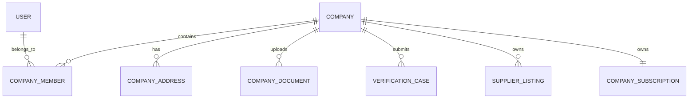

# Company Database Specification

Version: 1.0

Status: Active

Last Updated: August 2026

---

# Purpose

The Company domain manages all business organizations operating on Synthora.

Companies represent legal business entities.

Commercial assets belong to Companies rather than individual Users.

This specification defines all Company-related database tables.

---

# Tables Included

1. Company

2. CompanyMember

3. CompanyAddress

4. CompanyDocument

5. VerificationCase

---

# Domain Ownership

Owner Domain

Company

Dependencies

Identity

Used By

Listing

RFQ

Subscription

Review

Admin

---

# Database Design Principles

Companies own commercial assets.

Users own identities.

A Company may have multiple Users in future versions.

A Company may own multiple Listings.

Companies are never permanently deleted.

Soft delete is enabled.

---

# Entity Relationship

---

# 1. Company

## Purpose

Represents a registered business organization on Synthora.

Every supplier and buyer organization is represented as a Company.

Companies own commercial assets.

---

## Columns

| Column | Type | Required | Notes |
|---------|------|----------|------|
| id | UUID v7 | Yes | Primary Key |
| reference_number | VARCHAR(30) | Yes | Public Identifier |
| company_name | VARCHAR(255) | Yes | Display Name |
| legal_name | VARCHAR(255) | Yes | Registered Name |
| slug | VARCHAR(255) | Yes | SEO URL |
| description | TEXT | No | Company Overview |
| business_type_id | UUID | Yes | Lookup FK |
| year_established | SMALLINT | No | |
| gst_number | VARCHAR(30) | No | |
| iec_number | VARCHAR(30) | No | |
| website | VARCHAR(255) | No | |
| email | VARCHAR(255) | Yes | |
| phone | VARCHAR(20) | Yes | |
| logo_url | TEXT | No | |
| banner_url | TEXT | No | |
| verification_status_id | UUID | Yes | Lookup FK |
| company_status_id | UUID | Yes | Lookup FK |
| created_at | TIMESTAMPTZ | Yes | |
| created_by | UUID | No | |
| updated_at | TIMESTAMPTZ | Yes | |
| updated_by | UUID | No | |
| deleted_at | TIMESTAMPTZ | No | |
| deleted_by | UUID | No | |
| version | INTEGER | Yes | Optimistic Lock |

---

## Constraints

Primary Key

id

Unique

reference_number

slug

GST Number (when present)

IEC Number (when present)

---

## Indexes

company_name

slug

verification_status_id

company_status_id

deleted_at

---

## Business Rules

Company Names are not required to be globally unique.

Slug must be unique.

A Company cannot publish Listings until verified.

Suspended Companies cannot create Listings or RFQs.

Deleting a User never deletes a Company.

---

## Validation

Legal Name required.

Business Type required.

Email validation.

Phone validation.

Slug uniqueness.

GST format validation.

---

## Security

Only Company Owners may update Company information.

Sensitive information is never publicly exposed.

---

## Future Expansion

Multiple Warehouses.

Multiple Branches.

International Registration Numbers.

Multiple Business Addresses.

---

# 2. CompanyMember

## Purpose

Links Users to Companies.

Supports future multi-user organizations.

---

## Columns

| Column | Type | Required |
|---------|------|----------|
| id | UUID v7 | Yes |
| company_id | UUID | Yes |
| user_id | UUID | Yes |
| role_id | UUID | Yes |
| joined_at | TIMESTAMPTZ | Yes |
| invited_by | UUID | No |
| invitation_status_id | UUID | Yes |
| created_at | TIMESTAMPTZ | Yes |
| updated_at | TIMESTAMPTZ | Yes |

---

## Constraints

One User cannot have duplicate memberships in the same Company.

---

## Indexes

company_id

user_id

role_id

---

## Business Rules

MVP

One Owner.

Future

Multiple Members.

Multiple Roles.

---

# 3. CompanyAddress

## Purpose

Stores Company addresses.

Supports future multiple addresses.

---

## Columns

| Column | Type | Required |
|---------|------|----------|
| id | UUID v7 | Yes |
| company_id | UUID | Yes |
| address_line_1 | VARCHAR(255) | Yes |
| address_line_2 | VARCHAR(255) | No |
| city | VARCHAR(100) | Yes |
| state_id | UUID | Yes |
| country_id | UUID | Yes |
| postal_code | VARCHAR(20) | Yes |
| address_type_id | UUID | Yes |
| is_primary | BOOLEAN | Yes |
| created_at | TIMESTAMPTZ | Yes |

---

## Business Rules

One primary address per Company.

Supports future warehouse addresses.

---

# 4. CompanyDocument

## Purpose

Stores verification and compliance documents.

---

## Columns

| Column | Type | Required |
|---------|------|----------|
| id | UUID v7 | Yes |
| company_id | UUID | Yes |
| document_type_id | UUID | Yes |
| file_name | VARCHAR(255) | Yes |
| storage_path | TEXT | Yes |
| mime_type | VARCHAR(100) | Yes |
| file_size | BIGINT | Yes |
| visibility_id | UUID | Yes |
| uploaded_at | TIMESTAMPTZ | Yes |

---

## Business Rules

Files stored externally.

Database stores metadata only.

Documents are versionable.

---

# 5. VerificationCase

## Purpose

Tracks Company verification workflow.

---

## Columns

| Column | Type | Required |
|---------|------|----------|
| id | UUID v7 | Yes |
| company_id | UUID | Yes |
| verification_status_id | UUID | Yes |
| assigned_admin_id | UUID | No |
| submitted_at | TIMESTAMPTZ | Yes |
| completed_at | TIMESTAMPTZ | No |
| review_notes | TEXT | No |
| created_at | TIMESTAMPTZ | Yes |

---

## Business Rules

One active verification case per Company.

History preserved.

All decisions require administrative notes.

---

# Lookup Tables Used

BusinessType

CompanyStatus

VerificationStatus

CompanyRole

InvitationStatus

AddressType

Country

State

DocumentType

DocumentVisibility

---

# Domain Events

Company Created

↓

Company Profile Updated

↓

Verification Submitted

↓

Verification Approved

↓

Listing Creation Enabled

↓

Subscription Activated

---

# Security Rules

Company documents require authentication.

Verification documents are never public.

Company Owners manage Company data.

Administrative actions are fully audited.

---

# Performance

Indexes

Company Name

Slug

Business Type

Verification Status

Company Status

Deleted At

---

# Acceptance Criteria

Companies can

Register

Manage Profile

Upload Documents

Submit Verification

Track Verification Status

Support future multiple Users

Maintain complete audit history

Own all commercial assets independently of User accounts.