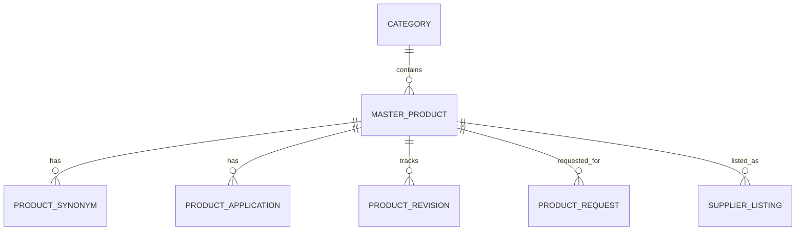

# Product Database Specification

Version: 1.0

Status: Active

Last Updated: August 2026

---

# Purpose

The Product domain manages the scientific product catalog of KemKendra.

Master Products are owned and maintained exclusively by KemKendra.

Suppliers cannot modify Master Product information.

Suppliers create commercial Listings against existing Master Products.

This specification defines all Product-related database tables.

---

# Tables Included

1. Category
2. MasterProduct
3. ProductSynonym
4. ProductApplication
5. ProductRevision
6. ProductRequest

---

# Domain Ownership

Owner Domain

Product

Dependencies

None

Used By

Listing

Search

RFQ

SEO

Admin

---

# Database Design Principles

Scientific information belongs to KemKendra.

Commercial information belongs to Supplier Listings.

Every commercially traded chemical should have only one Master Product.

Master Products are never duplicated.

Master Products exist independently of Supplier Listings.

Suppliers cannot modify scientific data.

Administrators manage all Master Product content.

---

# Entity Relationship

---

# 1. Category

## Purpose

Organizes Master Products into logical groups.

Supports navigation and search.

---

## Columns

| Column | Type | Required | Notes |
|---------|------|----------|------|
| id | UUID v7 | Yes | Primary Key |
| name | VARCHAR(150) | Yes | |
| slug | VARCHAR(150) | Yes | Unique |
| description | TEXT | No | |
| parent_category_id | UUID | No | Self Reference |
| display_order | INTEGER | Yes | |
| is_active | BOOLEAN | Yes | Default TRUE |
| created_at | TIMESTAMPTZ | Yes | |
| updated_at | TIMESTAMPTZ | Yes | |
| version | INTEGER | Yes | |

---

## Business Rules

Categories support unlimited hierarchy.

Categories cannot be deleted while products exist.

---

# 2. MasterProduct

## Purpose

Represents the canonical scientific definition of a chemical product.

Each Master Product represents one chemical regardless of the number of suppliers.

---

## Columns

| Column | Type | Required | Notes |
|---------|------|----------|------|
| id | UUID v7 | Yes | Primary Key |
| reference_number | VARCHAR(30) | Yes | Public Identifier |
| product_name | VARCHAR(255) | Yes | |
| slug | VARCHAR(255) | Yes | Unique |
| cas_number | VARCHAR(50) | Yes | Primary Identifier |
| molecular_formula | VARCHAR(100) | No | |
| molecular_weight | NUMERIC(12,4) | No | |
| category_id | UUID | Yes | FK |
| scientific_description | TEXT | No | |
| appearance | TEXT | No | |
| storage_conditions | TEXT | No | |
| handling_precautions | TEXT | No | |
| seo_title | VARCHAR(255) | No | |
| seo_description | TEXT | No | |
| seo_keywords | TEXT | No | |
| status_id | UUID | Yes | Lookup FK |
| created_at | TIMESTAMPTZ | Yes | |
| created_by | UUID | No | |
| updated_at | TIMESTAMPTZ | Yes | |
| updated_by | UUID | No | |
| deleted_at | TIMESTAMPTZ | No | |
| deleted_by | UUID | No | |
| version | INTEGER | Yes | |

---

## Constraints

Primary Key

id

Unique

reference_number

slug

cas_number

---

## Indexes

product_name

cas_number

slug

category_id

status_id

deleted_at

---

## Business Rules

Only Administrators may create Master Products.

Only Administrators may edit scientific information.

Supplier Listings reference Master Products.

Master Products remain available even without supplier listings.

---

# 3. ProductSynonym

## Purpose

Stores alternative names.

Supports scientific search.

---

## Columns

| Column | Type | Required |
|---------|------|----------|
| id | UUID v7 | Yes |
| master_product_id | UUID | Yes |
| synonym | VARCHAR(255) | Yes |
| is_primary | BOOLEAN | Yes |
| created_at | TIMESTAMPTZ | Yes |

---

## Business Rules

Unlimited synonyms allowed.

Duplicate synonyms not permitted for the same Master Product.

---

# 4. ProductApplication

## Purpose

Stores industrial applications.

---

## Columns

| Column | Type | Required |
|---------|------|----------|
| id | UUID v7 | Yes |
| master_product_id | UUID | Yes |
| application_name | VARCHAR(255) | Yes |
| description | TEXT | No |
| created_at | TIMESTAMPTZ | Yes |

---

## Business Rules

One Master Product may have many applications.

---

# 5. ProductRevision

## Purpose

Maintains scientific change history.

---

## Columns

| Column | Type | Required |
|---------|------|----------|
| id | UUID v7 | Yes |
| master_product_id | UUID | Yes |
| revision_number | INTEGER | Yes |
| changed_by | UUID | Yes |
| change_summary | TEXT | Yes |
| created_at | TIMESTAMPTZ | Yes |

---

## Business Rules

Every scientific change creates a revision.

Revision history is immutable.

---

# 6. ProductRequest

## Purpose

Allows suppliers to request new Master Products.

---

## Columns

| Column | Type | Required |
|---------|------|----------|
| id | UUID v7 | Yes |
| company_id | UUID | Yes |
| requested_product_name | VARCHAR(255) | Yes |
| requested_cas_number | VARCHAR(50) | No |
| molecular_formula | VARCHAR(100) | No |
| supporting_information | TEXT | No |
| supporting_document_url | TEXT | No |
| request_status_id | UUID | Yes |
| reviewed_by | UUID | No |
| reviewed_at | TIMESTAMPTZ | No |
| review_notes | TEXT | No |
| created_at | TIMESTAMPTZ | Yes |

---

## Business Rules

Only authenticated Companies may submit requests.

Duplicate requests should be detected.

Approved requests create a Master Product.

Rejected requests remain archived.

---

# Lookup Tables Used

CategoryStatus

ProductStatus

ProductRequestStatus

---

# Domain Events

Product Requested

↓

Request Reviewed

↓

Master Product Created

↓

Product Published

↓

Supplier Listing Enabled

---

# Security Rules

Only Administrators manage Master Products.

Suppliers may only request products.

Scientific information is protected.

Revision history cannot be modified.

---

# Performance

Indexes

Product Name

CAS Number

Slug

Category

Status

Deleted At

Search should prioritize CAS Number, Product Name and Synonyms.

---

# Acceptance Criteria

Administrators can

Create Master Products

Edit Scientific Information

Manage Categories

Publish Products

Review Product Requests

Suppliers can

Search Products

Request New Products

Create Listings only for approved Master Products

Every Master Product serves as the canonical scientific record for all Supplier Listings.