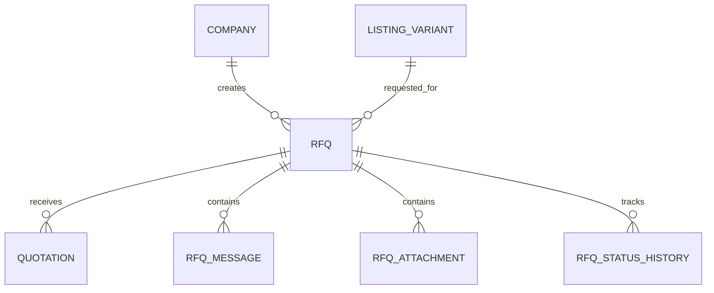

# RFQ Database Specification

Version: 1.0

Status: Active

Last Updated: August 2026

---

# Purpose

The RFQ domain manages the complete procurement workflow between Buyers and Suppliers.

An RFQ represents a buyer's request for quotation for a specific Listing Variant.

The RFQ system provides structured communication, quotation management, document sharing and complete audit history.

---

# Tables Included

1. RFQ

2. Quotation

3. RFQMessage

4. RFQAttachment

5. RFQStatusHistory

---

# Domain Ownership

Owner Domain

RFQ

Dependencies

Identity

Company

Listing

Product

Used By

Notification

Review

Admin

Analytics

---

# Database Design Principles

RFQs belong to Buyer Companies.

RFQs target Listing Variants.

RFQs maintain complete history.

Messages are immutable.

Quotations are versioned.

All workflow events are recorded.

---

# Entity Relationship

---

# 1. RFQ

## Purpose

Represents a quotation request created by a Buyer.

Each RFQ references one Listing Variant.

---

## Columns

| Column | Type | Required | Notes |
|---------|------|----------|------|
| id | UUID v7 | Yes | Primary Key |
| reference_number | VARCHAR(30) | Yes | Public Identifier |
| buyer_company_id | UUID | Yes | FK |
| supplier_company_id | UUID | Yes | FK |
| listing_variant_id | UUID | Yes | FK |
| quantity | NUMERIC(18,4) | Yes | |
| quantity_unit | VARCHAR(30) | Yes | |
| delivery_city | VARCHAR(150) | No | |
| delivery_state_id | UUID | No | Lookup FK |
| required_by_date | DATE | No | |
| buyer_message | TEXT | No | |
| current_status_id | UUID | Yes | Lookup FK |
| submitted_at | TIMESTAMPTZ | Yes | |
| created_at | TIMESTAMPTZ | Yes | |
| updated_at | TIMESTAMPTZ | Yes | |
| version | INTEGER | Yes | |

---

## Constraints

Primary Key

id

Unique

reference_number

---

## Indexes

buyer_company_id

supplier_company_id

listing_variant_id

current_status_id

submitted_at

---

## Business Rules

Each RFQ belongs to one Buyer Company.

Each RFQ targets one Listing Variant.

RFQs cannot be modified after submission.

Only participants may access the RFQ.

---

# 2. Quotation

## Purpose

Represents a supplier quotation for an RFQ.

Multiple quotation versions are supported.

---

## Columns

| Column | Type | Required |
|---------|------|----------|
| id | UUID v7 | Yes |
| reference_number | VARCHAR(30) | Yes |
| rfq_id | UUID | Yes |
| quotation_version | INTEGER | Yes |
| unit_price | NUMERIC(18,4) | Yes |
| currency | VARCHAR(10) | Yes |
| minimum_order_quantity | NUMERIC(18,4) | No |
| lead_time_days | INTEGER | No |
| validity_date | DATE | Yes |
| packaging_details | TEXT | No |
| commercial_notes | TEXT | No |
| created_at | TIMESTAMPTZ | Yes |

---

## Business Rules

Each new quotation creates a new version.

Previous quotations remain immutable.

Expired quotations cannot be accepted.

---

# 3. RFQMessage

## Purpose

Stores conversation between Buyer and Supplier.

---

## Columns

| Column | Type | Required |
|---------|------|----------|
| id | UUID v7 | Yes |
| rfq_id | UUID | Yes |
| sender_company_id | UUID | Yes |
| sender_user_id | UUID | Yes |
| message | TEXT | Yes |
| created_at | TIMESTAMPTZ | Yes |

---

## Business Rules

Messages cannot be edited.

Messages cannot be deleted.

Complete conversation history is preserved.

---

# 4. RFQAttachment

## Purpose

Stores RFQ-related documents.

---

## Columns

| Column | Type | Required |
|---------|------|----------|
| id | UUID v7 | Yes |
| rfq_id | UUID | Yes |
| uploaded_by_user_id | UUID | Yes |
| attachment_type_id | UUID | Yes |
| file_name | VARCHAR(255) | Yes |
| storage_path | TEXT | Yes |
| mime_type | VARCHAR(100) | Yes |
| file_size | BIGINT | Yes |
| uploaded_at | TIMESTAMPTZ | Yes |

---

## Business Rules

Files are stored externally.

Database stores metadata only.

Attachments remain permanently associated with the RFQ.

---

# 5. RFQStatusHistory

## Purpose

Maintains the complete lifecycle of every RFQ.

---

## Columns

| Column | Type | Required |
|---------|------|----------|
| id | UUID v7 | Yes |
| rfq_id | UUID | Yes |
| old_status_id | UUID | No |
| new_status_id | UUID | Yes |
| changed_by_user_id | UUID | Yes |
| remarks | TEXT | No |
| changed_at | TIMESTAMPTZ | Yes |

---

## Business Rules

Every status change creates a history record.

History is immutable.

Used for auditing and reporting.

---

# Lookup Tables Used

RFQStatus

AttachmentType

Currency

State

---

# RFQ Lifecycle

Draft

↓

Submitted

↓

Viewed

↓

Quotation Sent

↓

Negotiation

↓

Accepted

↓

Closed

Alternative States

Rejected

Expired

Cancelled

Archived

---

# Domain Events

RFQ Created

↓

Supplier Notified

↓

Quotation Submitted

↓

Buyer Notified

↓

Negotiation Started

↓

RFQ Closed

---

# Security Rules

Only RFQ participants may access the RFQ.

Administrators have controlled access.

Messages cannot be modified.

Attachments inherit RFQ permissions.

---

# Performance

Indexes

Buyer Company

Supplier Company

Listing Variant

Status

Submission Date

---

# Acceptance Criteria

Buyers can

Create RFQs

Upload Attachments

Track Status

Receive Quotations

Negotiate

Close RFQs

Suppliers can

Receive RFQs

Submit Quotations

Upload Documents

Reply to Buyers

Submit Revised Quotations

Every RFQ maintains a complete immutable procurement history.