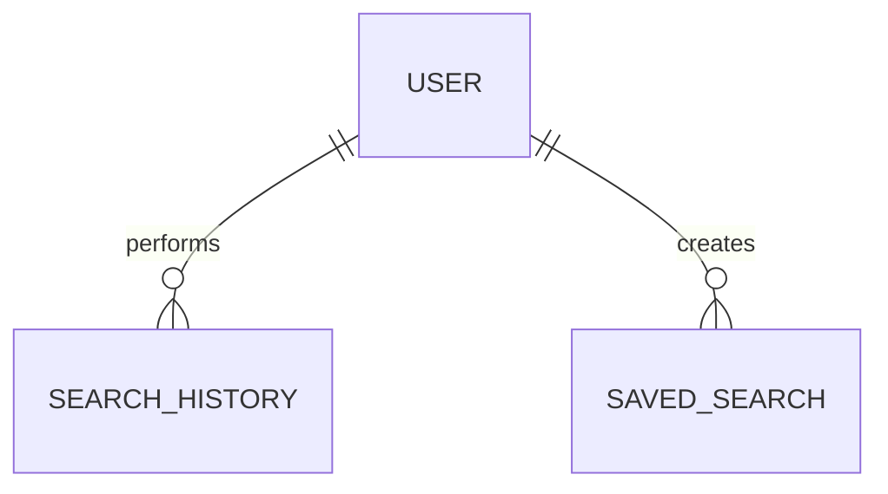

# Search Database Specification

Version: 1.0

Status: Active

Last Updated: August 2026

---

# Purpose

The Search domain supports intelligent product discovery across the Synthora marketplace.

Search is Product-First.

Master Products are always returned as the primary search result.

Supplier Listings are accessed through the corresponding Master Product.

This specification defines all Search-related database tables.

---

# Tables Included

1. SearchHistory

2. SavedSearch

---

# Domain Ownership

Owner Domain

Search

Dependencies

Identity

Product

Listing

Company

Used By

Homepage

Marketplace

RFQ

Analytics

---

# Database Design Principles

Search is Product-first.

Search should support scientific terminology.

Search supports Product Name, CAS Number, Synonyms and Company Name.

Search data belongs to Users.

Guest searches are not permanently stored.

---

# Entity Relationship

---

# 1. SearchHistory

## Purpose

Stores recent searches performed by authenticated users.

Search history improves usability and future analytics.

---

## Columns

| Column | Type | Required | Notes |
|---------|------|----------|------|
| id | UUID v7 | Yes | Primary Key |
| user_id | UUID | Yes | FK |
| search_query | VARCHAR(255) | Yes | |
| detected_search_type_id | UUID | Yes | Lookup FK |
| result_count | INTEGER | Yes | |
| searched_at | TIMESTAMPTZ | Yes | |

---

## Constraints

Primary Key

id

---

## Indexes

user_id

searched_at

search_query

---

## Business Rules

History belongs to Users.

Guest searches are not stored permanently.

History is private.

Duplicate searches are allowed.

---

# 2. SavedSearch

## Purpose

Allows users to save frequently used searches.

Feature available in future versions.

---

## Columns

| Column | Type | Required |
|---------|------|----------|
| id | UUID v7 | Yes |
| user_id | UUID | Yes |
| search_name | VARCHAR(255) | Yes |
| search_query | VARCHAR(255) | Yes |
| created_at | TIMESTAMPTZ | Yes |

---

## Business Rules

Users may create multiple Saved Searches.

Saved Searches are private.

Saved Searches may later generate alerts.

---

# Lookup Tables Used

SearchType

Examples

Product Name

CAS Number

Synonym

Company Name

Category

---

# Search Priority

1. Exact CAS Number

2. Exact Product Name

3. Exact Synonym

4. Exact Company Name

5. Partial Match

6. Typo Corrected Match

7. Similar Products

---

# Search Suggestions

Autocomplete supports

Product Name

CAS Number

Company Name

Category

Suggestions should never expose supplier-specific information.

---

# Domain Events

Search Performed

↓

Results Returned

↓

Product Viewed

↓

Supplier Listing Viewed

↓

RFQ Created

---

# Security Rules

Users may access only their own Search History.

Saved Searches are private.

No sensitive information is stored.

---

# Performance

Indexes

User

Search Query

Search Date

Search optimization should rely on PostgreSQL Full Text Search and dedicated indexes rather than scanning SearchHistory.

---

# Future Expansion

AI Search

Semantic Search

Natural Language Search

Saved Search Alerts

Personalized Ranking

Search Recommendations

Search Analytics

---

# Acceptance Criteria

Users can

Search Products

Search by CAS Number

Search by Synonyms

View Search History

Save Searches

Receive future Saved Search alerts

Search consistently prioritizes Master Products before Supplier Listings.