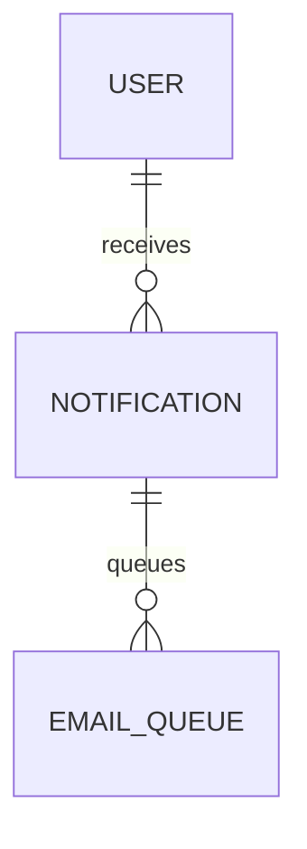

# Notification Database Specification

Version: 1.0

Status: Active

Last Updated: August 2026

---

# Purpose

The Notification domain manages communication between the Synthora platform and its users.

Notifications inform users about important business events and system activities.

Notifications are generated automatically from business events and delivered through one or more communication channels.

This specification defines all Notification-related database tables.

---

# Tables Included

1. Notification

2. EmailQueue

---

# Domain Ownership

Owner Domain

Notification

Dependencies

Identity

Used By

RFQ

Company

Listing

Review

Subscription

Admin

---

# Database Design Principles

Notifications are event-driven.

Notifications belong to Users.

One event may generate multiple notifications.

Notifications support multiple delivery channels.

Notification history is preserved.

---

# Entity Relationship

---

# 1. Notification

## Purpose

Stores in-app notifications generated from platform events.

Notifications provide users with timely updates and direct navigation to related resources.

---

## Columns

| Column | Type | Required | Notes |
|---------|------|----------|------|
| id | UUID v7 | Yes | Primary Key |
| reference_number | VARCHAR(30) | Yes | Public Identifier |
| user_id | UUID | Yes | FK |
| notification_type_id | UUID | Yes | Lookup FK |
| notification_category_id | UUID | Yes | Lookup FK |
| priority_id | UUID | Yes | Lookup FK |
| title | VARCHAR(255) | Yes | |
| message | TEXT | Yes | |
| target_entity_type | VARCHAR(100) | No | Example: RFQ, Listing |
| target_entity_id | UUID | No | |
| deep_link | VARCHAR(500) | No | |
| is_read | BOOLEAN | Yes | Default FALSE |
| read_at | TIMESTAMPTZ | No | |
| delivery_status_id | UUID | Yes | Lookup FK |
| created_at | TIMESTAMPTZ | Yes | |
| expires_at | TIMESTAMPTZ | No | Future |
| version | INTEGER | Yes | |

---

## Constraints

Primary Key

id

Unique

reference_number

---

## Indexes

user_id

notification_type_id

delivery_status_id

is_read

created_at

---

## Business Rules

Notifications belong to one User.

Notifications cannot be edited.

Notifications remain available after being read.

Users may mark notifications as read.

Notifications may optionally expire.

---

## Validation

Title required.

Message required.

Notification Type required.

User required.

---

## Security

Users may access only their own notifications.

Administrators may broadcast system notifications.

Sensitive information must never be exposed in notification content.

---

# 2. EmailQueue

## Purpose

Stores outgoing emails for asynchronous processing.

Email delivery should never block business workflows.

---

## Columns

| Column | Type | Required |
|---------|------|----------|
| id | UUID v7 | Yes |
| notification_id | UUID | Yes |
| recipient_email | VARCHAR(255) | Yes |
| subject | VARCHAR(255) | Yes |
| email_body | TEXT | Yes |
| email_status_id | UUID | Yes |
| retry_count | INTEGER | Yes |
| scheduled_at | TIMESTAMPTZ | No |
| sent_at | TIMESTAMPTZ | No |
| failed_at | TIMESTAMPTZ | No |
| failure_reason | TEXT | No |
| created_at | TIMESTAMPTZ | Yes |

---

## Constraints

Primary Key

id

---

## Indexes

notification_id

recipient_email

email_status_id

scheduled_at

---

## Business Rules

Emails are processed asynchronously.

Failed emails may be retried.

Retry attempts are recorded.

Delivery history is preserved.

---

# Lookup Tables Used

NotificationType

NotificationCategory

NotificationPriority

DeliveryStatus

EmailStatus

---

# Notification Categories

Authentication

Company

Verification

Product

Listing

RFQ

Quotation

Review

Subscription

Admin

System

---

# Domain Events

User Registered

↓

Email Verification

↓

Company Approved

↓

Listing Approved

↓

RFQ Received

↓

Quotation Submitted

↓

Review Received

↓

Subscription Updated

↓

System Announcement

---

# Security Rules

Users may only access their own notifications.

Email content should never expose sensitive business information.

Notification permissions inherit User authentication.

---

# Performance

Indexes

User

Notification Type

Read Status

Created Date

Delivery Status

Unread notification count should be optimized.

---

# Future Expansion

Push Notifications

SMS

WhatsApp

Browser Notifications

Slack

Microsoft Teams

Webhook Notifications

Notification Preferences

Notification Templates

Notification Digests

---

# Acceptance Criteria

Users can

Receive In-App Notifications

Receive Email Notifications

Mark Notifications as Read

View Notification History

Follow Deep Links

Administrators can

Broadcast System Announcements

Retry Failed Emails

View Delivery Status

Notification delivery remains asynchronous and scalable.