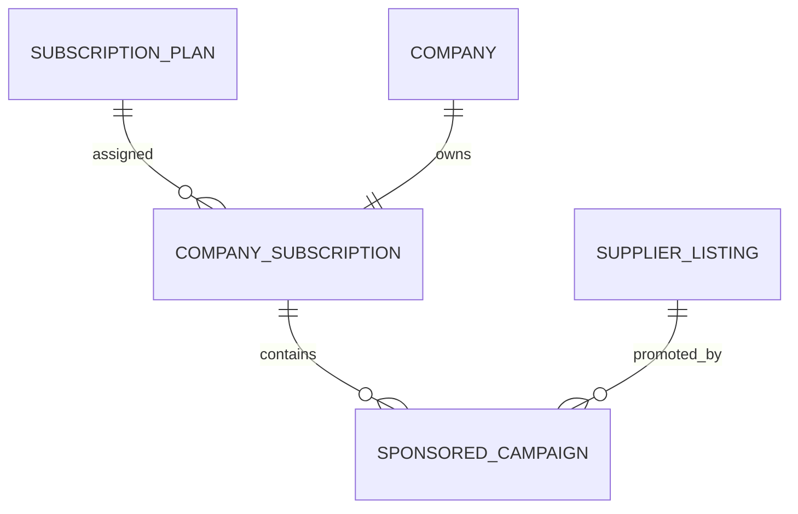

# Subscription Database Specification

Version: 1.0

Status: Active

Last Updated: August 2026

---

# Purpose

The Subscription domain manages Company subscription plans, premium marketplace features and sponsored campaigns.

Subscriptions belong to Companies rather than Users.

The subscription system is designed to support future billing integration while keeping the MVP free and fully functional.

This specification defines all Subscription-related database tables.

---

# Tables Included

1. SubscriptionPlan

2. CompanySubscription

3. SponsoredCampaign

---

# Domain Ownership

Owner Domain

Subscription

Dependencies

Company

Listing

Used By

Marketplace

Admin

Analytics

---

# Database Design Principles

Subscriptions belong to Companies.

Users inherit subscription benefits from their Company.

One Company has one active Subscription.

Feature access is controlled by the Company's Subscription.

Sponsored Campaigns promote Supplier Listings without affecting Master Products.

---

# Entity Relationship

---

# 1. SubscriptionPlan

## Purpose

Defines available subscription plans.

Subscription Plans control feature availability.

---

## Columns

| Column | Type | Required | Notes |
|---------|------|----------|------|
| id | UUID v7 | Yes | Primary Key |
| plan_name | VARCHAR(100) | Yes | |
| plan_code | VARCHAR(50) | Yes | Unique |
| description | TEXT | No | |
| display_order | INTEGER | Yes | |
| is_active | BOOLEAN | Yes | Default TRUE |
| created_at | TIMESTAMPTZ | Yes | |
| updated_at | TIMESTAMPTZ | Yes | |
| version | INTEGER | Yes | |

---

## Constraints

Primary Key

id

Unique

plan_code

---

## Business Rules

Plans are managed only by Administrators.

Plans should never be deleted.

Inactive plans remain available for historical subscriptions.

---

# 2. CompanySubscription

## Purpose

Represents the active subscription assigned to a Company.

Only one active subscription may exist per Company.

---

## Columns

| Column | Type | Required | Notes |
|---------|------|----------|------|
| id | UUID v7 | Yes | Primary Key |
| company_id | UUID | Yes | FK |
| subscription_plan_id | UUID | Yes | FK |
| subscription_status_id | UUID | Yes | Lookup FK |
| starts_at | TIMESTAMPTZ | Yes | |
| expires_at | TIMESTAMPTZ | No | |
| auto_renew | BOOLEAN | Yes | Default FALSE |
| assigned_by_admin_id | UUID | No | |
| created_at | TIMESTAMPTZ | Yes | |
| updated_at | TIMESTAMPTZ | Yes | |
| version | INTEGER | Yes | |

---

## Constraints

Primary Key

id

Unique

One active subscription per Company.

---

## Indexes

company_id

subscription_plan_id

subscription_status_id

expires_at

---

## Business Rules

Every Company starts with the Free Plan.

Administrators may manually upgrade or downgrade Companies.

Subscription history should never be deleted.

Subscription changes are logged.

---

# 3. SponsoredCampaign

## Purpose

Represents a paid promotional campaign for a Supplier Listing.

Sponsored Campaigns improve visibility but never replace Master Products.

---

## Columns

| Column | Type | Required | Notes |
|---------|------|----------|------|
| id | UUID v7 | Yes | Primary Key |
| company_subscription_id | UUID | Yes | FK |
| supplier_listing_id | UUID | Yes | FK |
| campaign_name | VARCHAR(255) | Yes | |
| campaign_status_id | UUID | Yes | Lookup FK |
| priority | INTEGER | Yes | |
| starts_at | TIMESTAMPTZ | Yes | |
| ends_at | TIMESTAMPTZ | Yes | |
| created_at | TIMESTAMPTZ | Yes | |
| updated_at | TIMESTAMPTZ | Yes | |

---

## Constraints

Primary Key

id

---

## Indexes

supplier_listing_id

campaign_status_id

starts_at

ends_at

priority

---

## Business Rules

Only approved Supplier Listings may be promoted.

Campaigns expire automatically.

Expired campaigns are retained for history.

Sponsored Listings are clearly identified in search results.

Sponsored Campaigns never replace Master Products.

---

# Lookup Tables Used

SubscriptionStatus

CampaignStatus

Future

SubscriptionFeature

BillingStatus

---

# Subscription Lifecycle

Free

↓

Premium

↓

Renewed

↓

Expired

↓

Downgraded

↓

Cancelled

---

# Domain Events

Subscription Activated

↓

Premium Features Enabled

↓

Sponsored Campaign Created

↓

Campaign Published

↓

Campaign Expired

---

# Security Rules

Only Company Owners may manage subscriptions.

Only Administrators may assign or override subscriptions.

Subscription information is private.

Campaign management requires an active subscription.

---

# Performance

Indexes

Company

Subscription Status

Campaign Status

Campaign Dates

Expiration Date

---

# Future Expansion

Payment Gateway

Invoices

Coupons

Trial Plans

Enterprise Plans

Usage-Based Billing

Feature Flags

API Access

Partner Plans

---

# Acceptance Criteria

Companies can

View Active Subscription

Upgrade Subscription

View Subscription History

Create Sponsored Campaigns

Manage Campaigns

Administrators can

Create Subscription Plans

Assign Plans

Upgrade Companies

Downgrade Companies

Suspend Subscriptions

Manage Sponsored Campaigns

The subscription system supports future monetization without requiring database redesign.