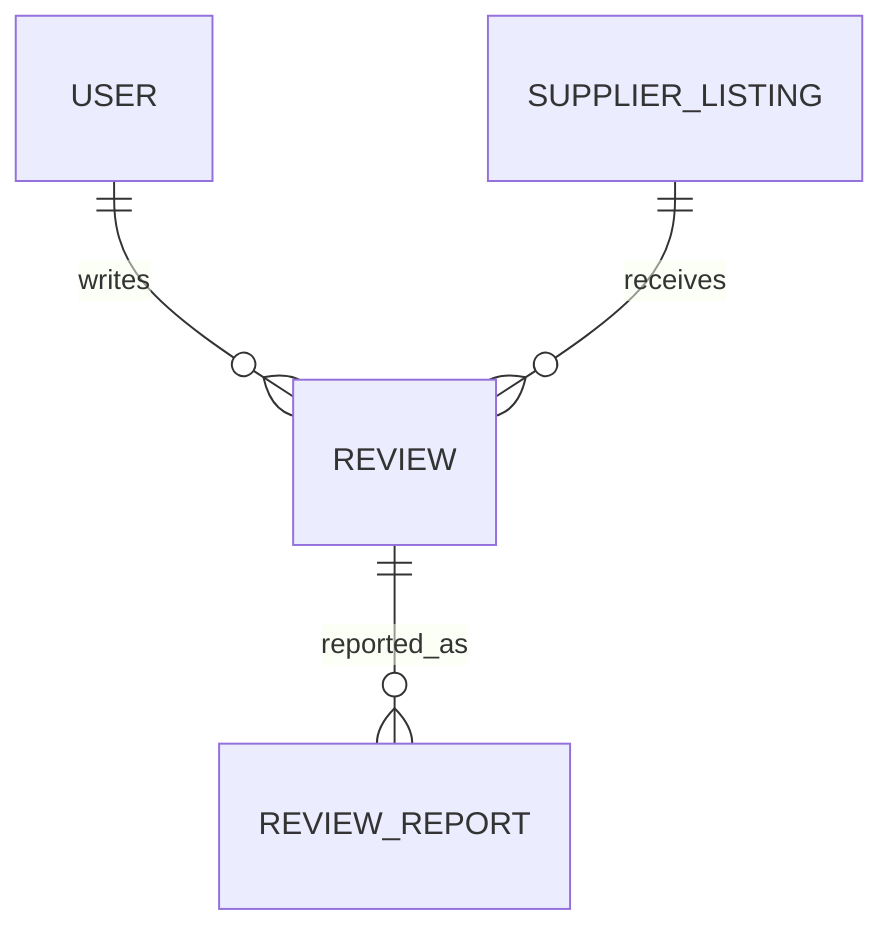

# Review Database Specification

Version: 1.0

Status: Active

Last Updated: August 2026

---

# Purpose

The Review domain manages buyer feedback and supplier reputation across the Synthora marketplace.

Reviews help buyers evaluate suppliers based on product quality, communication, delivery experience and overall satisfaction.

Reviews belong to Supplier Listings rather than Master Products.

This specification defines all Review-related database tables.

---

# Tables Included

1. Review

2. ReviewReport

---

# Domain Ownership

Owner Domain

Review

Dependencies

Identity

Company

Listing

RFQ

Used By

Marketplace

Search

Admin

Analytics

---

# Database Design Principles

Reviews belong to Supplier Listings.

Reviews are created by Buyers.

Reviews cannot modify Supplier Listings.

Moderation protects review quality.

Review history is preserved.

---

# Entity Relationship

---

# 1. Review

## Purpose

Represents a buyer's review for a Supplier Listing.

Each review contributes to the supplier's public reputation.

---

## Columns

| Column | Type | Required | Notes |
|---------|------|----------|------|
| id | UUID v7 | Yes | Primary Key |
| reference_number | VARCHAR(30) | Yes | Public Identifier |
| reviewer_user_id | UUID | Yes | FK |
| reviewer_company_id | UUID | Yes | FK |
| supplier_listing_id | UUID | Yes | FK |
| rfq_id | UUID | No | Future Verified Purchase |
| overall_rating | NUMERIC(2,1) | Yes | 1.0–5.0 |
| product_quality_rating | SMALLINT | No | 1–5 |
| communication_rating | SMALLINT | No | 1–5 |
| delivery_rating | SMALLINT | No | 1–5 |
| title | VARCHAR(255) | Yes | |
| review_text | TEXT | Yes | |
| is_verified_purchase | BOOLEAN | Yes | Default FALSE |
| moderation_status_id | UUID | Yes | Lookup FK |
| is_public | BOOLEAN | Yes | Default TRUE |
| published_at | TIMESTAMPTZ | No | |
| created_at | TIMESTAMPTZ | Yes | |
| updated_at | TIMESTAMPTZ | Yes | |
| version | INTEGER | Yes | |

---

## Constraints

Primary Key

id

Unique

reference_number

One review per Buyer Company per Supplier Listing.

---

## Indexes

supplier_listing_id

reviewer_company_id

overall_rating

moderation_status_id

published_at

---

## Business Rules

Reviews belong to Supplier Listings.

Reviews do not belong to Master Products.

Only authenticated Buyers may submit Reviews.

Only published Reviews are publicly visible.

One Buyer Company may submit only one active Review for a Supplier Listing.

Reviews remain preserved for audit purposes.

---

## Validation

Overall Rating required.

Title required.

Review Text required.

Rating must be between 1 and 5.

---

## Security

Review authors may edit their Review until moderation begins.

Administrators may hide Reviews violating marketplace policies.

Published Reviews are immutable.

---

# 2. ReviewReport

## Purpose

Allows users to report inappropriate or fraudulent Reviews.

---

## Columns

| Column | Type | Required |
|---------|------|----------|
| id | UUID v7 | Yes |
| review_id | UUID | Yes |
| reported_by_user_id | UUID | Yes |
| report_reason_id | UUID | Yes |
| report_description | TEXT | No |
| moderation_status_id | UUID | Yes |
| resolved_by_admin_id | UUID | No |
| resolved_at | TIMESTAMPTZ | No |
| created_at | TIMESTAMPTZ | Yes |

---

## Constraints

Primary Key

id

---

## Indexes

review_id

reported_by_user_id

moderation_status_id

---

## Business Rules

Multiple Reports may exist for one Review.

Reports never automatically remove Reviews.

Only Administrators may resolve Reports.

All moderation actions are audited.

---

# Lookup Tables Used

ModerationStatus

ReviewReportReason

RatingScale

---

# Review Lifecycle

Draft

↓

Submitted

↓

Moderation

↓

Published

↓

Reported

↓

Resolved

↓

Archived

---

# Domain Events

Review Submitted

↓

Moderation Started

↓

Review Published

↓

Review Reported

↓

Report Resolved

---

# Security Rules

Only authenticated Buyers may submit Reviews.

Only Review authors may edit pending Reviews.

Only Administrators may moderate Reviews.

Reported Reviews remain visible unless removed by moderation.

---

# Performance

Indexes

Supplier Listing

Reviewer Company

Overall Rating

Moderation Status

Published Date

---

# Future Expansion

Verified Purchase Reviews

Supplier Responses

Review Voting

Review Images

Review Attachments

Review Analytics

AI Review Moderation

Review Helpfulness Score

---

# Acceptance Criteria

Buyers can

Submit Reviews

Edit Pending Reviews

Report Reviews

View Review History

Suppliers can

View Reviews

Track Reputation

View Review Statistics

Administrators can

Moderate Reviews

Hide Reviews

Resolve Reports

Audit Review History

The Review system provides a trustworthy and transparent supplier reputation mechanism.