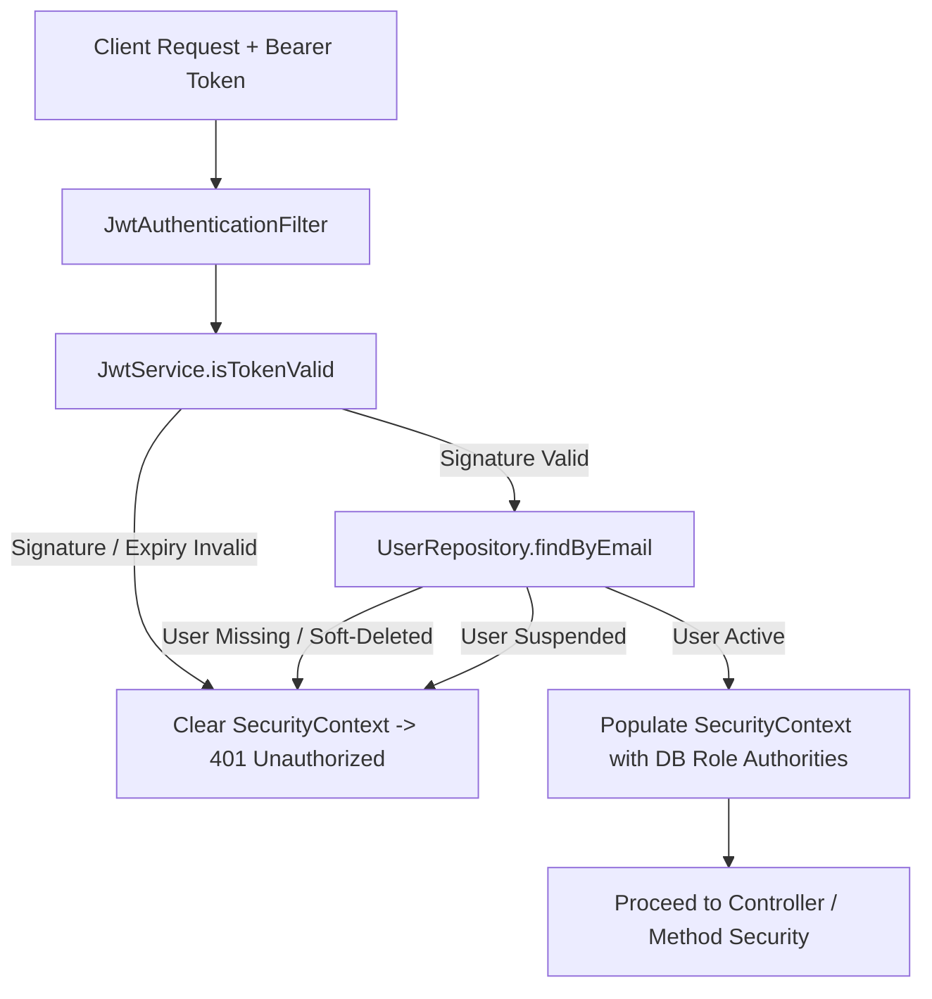

# Synthora JWT Security & Session Architecture Review

---

## 1. Overview & Architecture

Synthora employs stateless JSON Web Tokens (JWT) for authenticating REST API requests between the client frontend (Next.js 16) and backend services (Spring Boot 3.4).

### Key Architectural Characteristics:
1. **Stateless Bearer Tokens**: Tokens are generated on successful `POST /api/v1/auth/login` and sent via `Authorization: Bearer <token>` HTTP headers.
2. **Server-Authoritative Role Resolution**: Authorities (`ROLE_USER`, `ROLE_SUPPLIER`, `ROLE_ADMIN`) are resolved **from the PostgreSQL database directly** during each authenticated request, rather than trusting client-provided claims in the JWT payload.
3. **Active Account Verification**: Suspended or soft-deleted user accounts are instantly blocked by [`JwtAuthenticationFilter.java`](file:///d:/Saisaket/Synthora/backend/src/main/java/com/synthora/security/JwtAuthenticationFilter.java) even if a mathematically valid JWT is presented.

> [!NOTE]
> **Single-Instance & Stateless Scope**:
> Current implementation is suitable for a single application instance without distributed Redis infrastructure. Blacklisting and distributed revocation are intentionally deferred to future enterprise horizontal scaling phases.

---

## 2. JWT Signing & Secret Key Management

| Parameter | Specification | Security Control |
| :--- | :--- | :--- |
| **Signing Algorithm** | HMAC-SHA256 (`HS256`) | Cryptographically enforced via `Keys.hmacShaKeyFor(secret.getBytes(StandardCharsets.UTF_8))`. |
| **Key Length** | Minimum 256 bits (32+ bytes) | Validated at startup in `JwtService.validateConfiguration()`. Fails fast if secret is short or weak. |
| **Issuer (`iss`)** | `synthora` | Attached to all issued tokens. |
| **Audience (`aud`)** | `synthora-api` | Configured for API resource verification. |
| **Token Lifetime** | 24 Hours (`86,400,000 ms`) | Configurable via `JWT_EXPIRATION` environment variable. |
| **Production Fail-Fast** | `jwt.secret: ${JWT_SECRET}` | No default fallback in `application.yml` or `application-prod.yml`. Missing secret blocks production container startup. |

---

## 3. Claim Validation & Defense-in-Depth

### Protection Against Common JWT Vulnerabilities:
- **Algorithm Confusion Attacks**: JJWT 0.12.x requires exact HMAC key matching, inherently rejecting unsigned tokens (`alg: none`) or mismatched key type substitutions.
- **Payload Tampering**: Any modification to the payload (e.g. altering subject email or changing `"role": "ADMIN"`) invalidates the cryptographic signature, resulting in immediate 401 rejection.
- **Privilege Escalation Defense**: Even if an attacker were to forge or obtain a token claiming `ADMIN`, Spring Security grants permissions based on `user.getRole()` retrieved from the database, not the token payload.
- **Anti-Logging Safety**: Raw JWTs, HMAC keys, password hashes, and verification/reset tokens are strictly excluded from logging statements.

---

## 4. Frontend Token Storage & XSS Mitigation

- **Current Mechanism**: Stored in `localStorage` (`synthora_token`) and dispatched via `authenticatedFetch.ts`.
- **Mitigation Layers**:
  - Strict Content Security Policy (CSP) with `default-src 'self'`, `object-src 'none'`, and `frame-ancestors 'none'` prevents external script injection.
  - Sanitized React virtual DOM renders prevent stored XSS across marketplace product listings and supplier profiles.
- **Future Roadmap**: Migration to secure, SameSite, `HttpOnly` cookie-based session management when cross-origin subdomains or SSR session exchange is introduced.

---

## 5. Session Lifecycle & Interactions

### A. Logout
- **Client Action**: Clears `synthora_token` from browser `localStorage` and triggers the `auth-changed` event, redirecting to login.
- **Server Action**: Stateless; token expires naturally at its expiration timestamp.

### B. Password Change / Reset
- **Password Reset**: Successfully resetting a password marks the reset token as used and invalidates any outstanding reset tokens for the user.
- **Password Change**: Requires verification of the existing password via `BCryptPasswordEncoder.matches()`.

### C. Email Verification Guard
- Unverified users attempting login are rejected with a 400 Bad Request prompting email verification.
- Admin users retain emergency access bypass for initial platform bootstrapping.

---

## 6. Verification & Automated Test Coverage

The JWT security hardening is validated by [`JwtSecurityHardeningTest.java`](file:///d:/Saisaket/Synthora/backend/src/test/java/com/synthora/security/JwtSecurityHardeningTest.java):
1. Valid JWT grants access with correct role mapping.
2. Expired JWT is rejected with 401.
3. Tampered payload is rejected with 401.
4. Token signed with untrusted key is rejected with 401.
5. Malformed, empty, and non-Bearer tokens are rejected with 401.
6. Privilege escalation via claim tampering is blocked.
7. Role separation: USER cannot access ADMIN endpoints (403 Forbidden).
8. Role separation: SUPPLIER cannot access ADMIN endpoints (403 Forbidden).
9. Suspended accounts are rejected even with valid JWTs.
10. Soft-deleted accounts are rejected even with valid JWTs.
