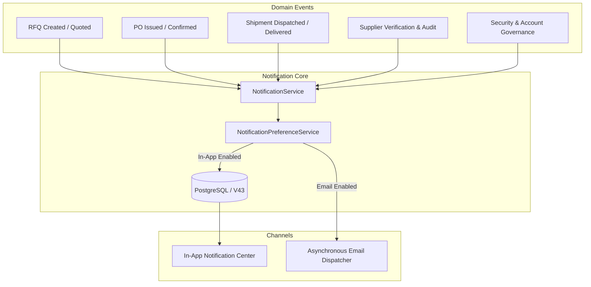

# KemKendra — Phase 1.14: Notification & Communication Center

## 1. Overview & Architecture

The **KemKendra Notification & Communication Center** transforms the platform's messaging infrastructure into an enterprise-grade, secure, multi-channel communication engine for buyers, verified chemical suppliers, and administrators.

---

## 2. Database Schema Migration (V43)

The database was upgraded via Flyway migration `V43__create_user_notification_preferences_and_enhance_notifications.sql`:

1. **Enhanced `notifications` Table**:
   - Added `category` (`VARCHAR(64)` NOT NULL with default derivation).
   - Added `priority` (`VARCHAR(32)` NOT NULL with default `'NORMAL'`).
   - Indexes added on `(recipient_id, category, read)` and `(recipient_id, created_at DESC)`.

2. **New `user_notification_preferences` Table**:
   - Stores per-user, per-category channel settings (`in_app_enabled`, `email_enabled`).
   - Unique constraint on `(user_id, category)`.
   - Index on `user_id`.

---

## 3. Core Entities & Categorization

### Notification Categories
- `SECURITY` *(Mandatory)*: Account login alerts, password changes, security notifications.
- `ACCOUNT` *(Mandatory)*: Verification status, profile changes, legal acceptance.
- `SUPPLIER_VERIFICATION`: Document submissions, verification approvals, audit findings.
- `RFQ`: Chemical requests for quotation submissions, status updates, expiries.
- `QUOTATION`: Quotation submissions, counter-offers, acceptance/rejections.
- `PURCHASE_ORDER`: Purchase order generation, confirmation, cancellations.
- `SHIPMENT`: Shipment dispatches, transit milestones, delivery receipts.
- `CATALOG`: Master catalog product requests, synonym mappings, offering moderation.
- `GOVERNANCE`: Account suspensions, reinstatement, appeal workflows.
- `SYSTEM`: General platform maintenance and administrative notifications.

### Notification Priorities
- `LOW`: Informational events (e.g. order delivery completed, RFQ expired).
- `NORMAL`: Standard commercial transactions (e.g. RFQ submitted, quote received).
- `HIGH`: Time-sensitive operational actions (e.g. clarification required, PO cancelled).
- `CRITICAL`: Security & governance events (e.g. account suspension, appeal rejected).

---

## 4. API Reference

### Notification Center Endpoints (`/api/v1/notifications`)
| Method | Endpoint | Description | Auth Required |
|---|---|---|---|
| `GET` | `/api/v1/notifications` | Paginated notifications with optional `category` and `read` filters | User / Supplier / Admin |
| `GET` | `/api/v1/notifications/unread-count` | Returns exact unread notification count | User / Supplier / Admin |
| `PUT` | `/api/v1/notifications/{id}/read` | Marks a specific notification as read | Recipient Only (IDOR Protected) |
| `PUT` | `/api/v1/notifications/read-all` | Marks all notifications for current user as read | Authenticated User |

### Preference Management Endpoints (`/api/v1/users/me/notification-preferences`)
| Method | Endpoint | Description | Auth Required |
|---|---|---|---|
| `GET` | `/api/v1/users/me/notification-preferences` | Returns channel preferences across all categories | Authenticated User |
| `PUT` | `/api/v1/users/me/notification-preferences` | Bulk updates non-mandatory category channel preferences | Authenticated User |

---

## 5. Security & Isolation Controls

1. **IDOR Prevention**:
   - All read and write queries strictly resolve `recipientId = authenticatedUser.getId()`.
   - Users cannot view, modify, mark as read, or probe other users' notifications.
2. **Mandatory Category Lock**:
   - `SECURITY` and `ACCOUNT` notifications cannot be disabled by users (`isMandatory() == true`).
   - Preference update requests attempting to disable mandatory categories return `400 Bad Request`.
3. **Safe Server-Side Deep Links**:
   - Deep link redirection routes are computed entirely on the server based on entity type and ID (`NotificationResponse.resolveSafeTargetRoute`).
   - Arbitrary client redirect URLs cannot be injected into notifications.
4. **Non-Blocking Email Delivery**:
   - Email dispatch is executed asynchronously (`@Async("emailTaskExecutor")`) with full exception isolation so email delivery failures never roll back core marketplace transactions.
5. **Sensitive Data Sanitization**:
   - Zero password hashes, reset tokens, email verification tokens, JWTs, or SMTP credentials are ever stored in notification messages or exposed in API DTOs.
6. **Bounded Pagination**:
   - Page size is clamped server-side to a maximum of 100 items per request to prevent resource exhaustion attacks.

---

## 6. Verification Results

- **Backend Test Suite**: **1,493 tests passing**, 0 failures, 0 errors, 0 skipped.
- **Frontend Build**: Next.js 16 (Turbopack) production build passed with **0 TypeScript and ESLint errors**.
