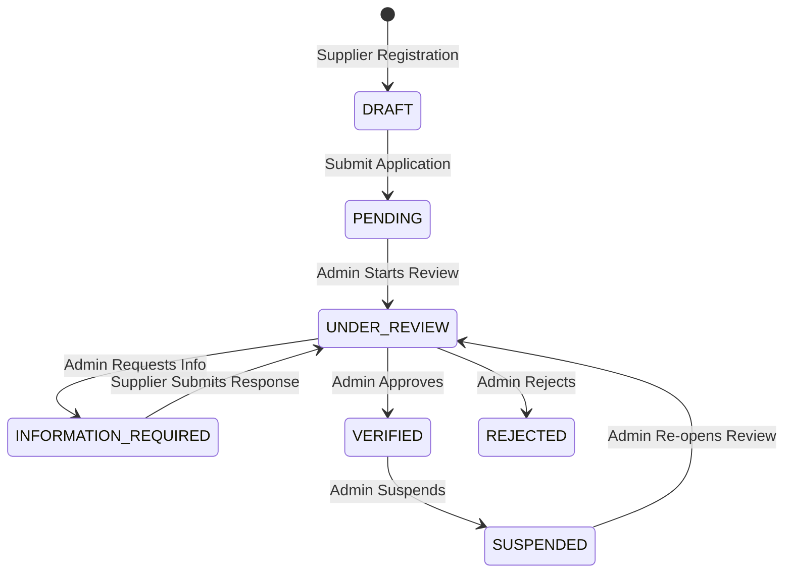

# KemKendra — Professional Supplier Verification Center Architecture

This document specifies the architecture, compliance lifecycle, domain model, security controls, and operational workflows for the **KemKendra B2B Chemical Marketplace Supplier Verification Center** (Phase 1.9).

---

## 1. Architecture & Domain Model Overview

Supplier verification in KemKendra provides evidence-based corporate identity verification, tax identity validation, authorized representative authentication, and commercial compliance assurance before suppliers are authorized to participate in enterprise chemical cataloging and transaction workflows.

### Entity & Schema Mapping Matrix

| Domain Property / Capability | Supporting Entity / Schema Table | Description |
|---|---|---|
| **Legal Company Name** | `Supplier.legalName` (`suppliers.legal_name`) | Registered statutory business name |
| **Trade Name (DBA)** | `Supplier.tradeName` (`suppliers.trade_name`) | Commercial trading identifier |
| **Registration Number** | `Supplier.companyRegistrationNumber` (`suppliers.company_registration_number`) | Corporate registry / CIN / CRN number |
| **Business Type** | `Supplier.businessType` (`suppliers.business_type`) | `MANUFACTURER`, `DISTRIBUTOR`, `TRADER` |
| **Registered Address** | `Supplier.registeredAddress`, `city`, `stateProvince`, `postalCode`, `countryName` | Corporate headquarters address |
| **Business Contact** | `Supplier.authorizedRepresentativeName`, `authorizedRepresentativeDesignation`, `businessEmail`, `businessPhone` | Verified corporate signatory |
| **Commercial Profile** | `Supplier.primaryCategories`, `countriesServed`, `yearsInBusiness`, `exportReady` | Market reach & export compliance readiness |
| **Tax / VAT Identification** | `Supplier.taxVatNumber` (`suppliers.tax_vat_number`) | Federal tax ID / EIN / VAT / GSTIN |
| **Verification Evidences** | `SupplierVerificationEvidence` (`supplier_verification_evidences`) | Checklist item status & attached document links |
| **Verification Audits** | `SupplierVerificationAudit` (`supplier_verification_audits`) | State transition trail and reviewer notes |
| **Compliance Documents** | `Document` (`documents`) | Authorized files (CRN, ISO, Tax, GMP licenses) |
| **In-App Notifications** | `NotificationService` (`notifications`) | Real-time alerts for suppliers and admins |

---

## 2. Supplier Verification Lifecycle

### Status Definitions

1. **`DRAFT`**: Profile is incomplete or being prepared by the supplier. The supplier can incrementally save progress.
2. **`PENDING`**: Supplier has submitted their application and is queued for compliance officer assignment.
3. **`UNDER_REVIEW`**: Compliance officer has opened the supplier's dossier and is conducting due diligence.
4. **`INFORMATION_REQUIRED`**: Admin requested specific updates or missing documents. Supplier sees a prominent alert and remediation response desk.
5. **`VERIFIED`**: Supplier has satisfied all mandatory verification criteria and is approved for marketplace trading.
6. **`REJECTED`**: Application failed compliance checks; reason is recorded and communicated to the applicant.
7. **`SUSPENDED`**: Verified status revoked due to regulatory or policy issues.

---

## 3. Supplier Self-Service Experience (`/dashboard/supplier/verification`)

The supplier portal provides a guided 6-step verification center:

1. **Step 1: Company Identity**: Legal name, trade name, registration number, business type, corporate address, website, description.
2. **Step 2: Business Contact**: Authorized representative name, designation, direct business email, and phone.
3. **Step 3: Business Profile**: Primary chemical categories, regions served, years in operation, export readiness.
4. **Step 4: Compliance Documentation**: Tax/VAT number, Business Registration Certificate, ISO 9001/Quality certs, Manufacturing Licenses with direct upload and checklist binding.
5. **Step 5: Declarations**: Accuracy declaration and corporate representation authorization.
6. **Step 6: Review & Submit**: Comprehensive checklist overview, submit action (`DRAFT` → `PENDING`), or remediation response action (`INFORMATION_REQUIRED` → `UNDER_REVIEW`).

---

## 4. Admin Verification Center (`/dashboard/admin/suppliers/verification`)

Administrators have access to:

1. **Verification Queue**:
   - Status filters: `ALL`, `PENDING`, `UNDER_REVIEW`, `INFORMATION_REQUIRED`, `VERIFIED`, `REJECTED`, `SUSPENDED`.
   - Real-time search across company name, legal entity name, and country.
   - Quick navigation to individual supplier dossiers.

2. **Dossier & Evidence Workspace**:
   - **Start Review**: Transitions status from `PENDING` to `UNDER_REVIEW`.
   - **Item Verification**: Verify, flag, or reject individual checklist items and attached documents.
   - **Request Information**: Add structured notes explaining required corrections.
   - **Approve & Verify**: Validates that all mandatory items are verified or requires an explicit admin override reason.
   - **Reject Application**: Requires mandatory rejection explanation.
   - **Suspend Supplier**: Requires mandatory suspension reason.

---

## 5. Security & Authorization

1. **Role-Based Access Control (RBAC)**:
   - Supplier endpoints (`/api/v1/supplier/verification/**`): Strictly restricted to `ROLE_SUPPLIER`.
   - Admin endpoints (`/api/v1/admin/suppliers/**`): Strictly restricted to `ROLE_ADMIN`.
   - Buyer accounts (`ROLE_USER`): Receive `403 Forbidden`.
   - Unauthenticated requests: Receive `401 Unauthorized`.

2. **Insecure Direct Object Reference (IDOR) Protection**:
   - Suppliers can query and update only their own operational supplier entity (resolved via authentication context).
   - Attempting to query another supplier's verification endpoint returns `403 Forbidden` or `404 Not Found`.

3. **Document Security**:
   - All compliance documents uploaded by suppliers are mediated by `DocumentAuthorizationService`.
   - Admins can review compliance documents across all suppliers.
   - Cross-supplier document downloads by unauthorized sellers are denied.

4. **Resilience**:
   - In-app notification creation and transactional email dispatch are non-blocking. Email failure does not roll back database verification status updates.

---

## 6. Future Roadmap

- **Phase 1.10 — Admin Catalog & Supplier Offering Management**: Admin catalog authoring, offering creation on behalf of suppliers, offering moderation, and chemical-level document compliance.
- **Phase 1.11 — User Suspension, Reinstatement & Appeals**: Formal appeal submission workflow for suspended suppliers with appeal review desk.
- **Phase 1.12 — Admin Audit & Governance Engine**: Immutable cryptographic action logs for sensitive admin overrides and compliance decisions.
